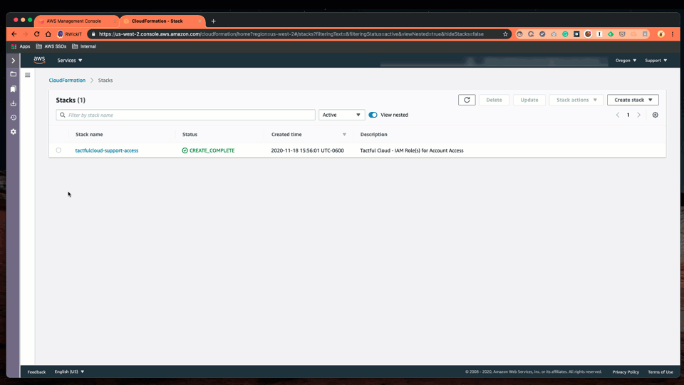
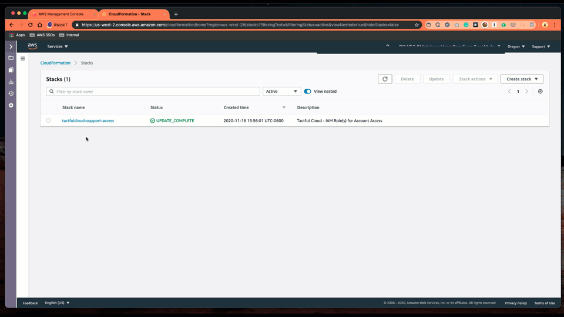

# Support Access Roles

## Access Roles & Permissions

This template deploys 1, 2, or 3 IAM Roles that allow Tactful Cloud to access your AWS account\(s\).

Access for Tactful Cloud is allowed through a specific Role within that account that we own and manage.

* Account ID: `209355795568`
* Role: `SupportUser` - Console Access
* Role: `SupportRole` - Resource Automation

> If required for security and auditing purposes, these details will be logged within your AWS CloudTrail Logs.

Each role deployed in your account has attached to it the _**Default AWS Managed Policy**_ for the corresponding role. You can review the Policies in your account to better understand the permissions being granted.

## Permissions

The following permission levels can be deployed with this template.

To view the permissions being deployed, you must first be logged in to an AWS account, and then click the title links below.

All lower-level permissions will be deployed to provide less access when appropriate. \(View Only is always deployed. Read-Only will be deployed if Administrator is deployed\)

> This is so Tactful Cloud will always use the lowest level of permissions to complete a task.

1. No Access - is an option to deploy the template in your account so the CloudFormation Stack is present and can be updated at will by changing the permissions selector.
2. [View Only](https://console.aws.amazon.com/iam/home?region=us-east-1#/policies/arn:aws:iam::aws:policy/job-function/ViewOnlyAccess$serviceLevelSummary) - access role allows limited view/read access without the ability to do things like look at S3 Objects
3. [Read-Only](https://console.aws.amazon.com/iam/home?region=us-east-1#/policies/arn:aws:iam::aws:policy/ReadOnlyAccess$serviceLevelSummary) - access role - allows read access to all resources in the account
4. [Administrator](https://console.aws.amazon.com/iam/home?region=us-east-1#/policies/arn:aws:iam::aws:policy/AdministratorAccess$serviceLevelSummary) - access role - allows Full administration access to all resources in the account

## Deployment

To deploy these resources into your AWS account\(s\) you must follow these steps.

1. Be logged into the AWS Account
2. Be in the region you wish to deploy this stack. TactfulCloud recommends `US EAST (N. Virginia) us-east-1`
3. From the same browser session click the **Launch Stack** button below for the desired deployment
4. Acknowledge \(Check Box\) in the CloudFormation Review window that this stack will deploy IAM Resources
5. Click the **Create** Button

> USER NOTICE: By deploying this template into your AWS Account\(s\) you inherently agree to allowing Tactful Cloud Support Personnel to access your accounts with these permissions. Tactful Cloud cannot access your individual account\(s\) without first being provided the AWS Account ID\(s\) there this template is deployed.

| Permissions | Launch Button |
| :--- | :--- |
| No Access |  |
| View Only |  |
| Read Only |  |
| Administrator |  |

Or you can download the template from [http://aws-support.tactfulcloud.com/iam/tactfulcloud-support-access.yml](http://aws-support.tactfulcloud.com/iam/tactfulcloud-support-access.yml) to deploy manually.

## Updating Permissions

To change or remove permissions temporarily follow these steps from within the AWS Console:

1. Change the region to where this template was originally deployed
2. Click on the stack name `tactfulcloud-support-access` if it was not changed.
3. Select _Update_
4. Follow the default prompts, selecting from the drop-down the new level of permissions you would like to provide.
5. Complete prompts until you update the template.
6. Permissions will be modified accordingly and any previous resources will be removed if permissions have been lowered.

### Deleting Permissions

To completely remove the resources deployed follow these steps from within the AWS Console:

1. Change the region to where this template was originally deployed
2. Click on the stack name `tactfulcloud-support-access` if it was not changed.
3. Select _Delete_
4. Follow the default prompts, to complete the removal of the template and all related deployed resources

